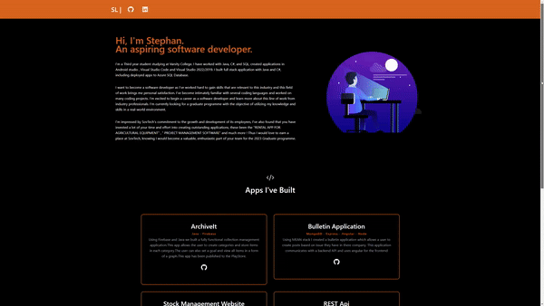

# Getting Started with Create React App

This project was bootstrapped with [Create React App](https://github.com/facebook/create-react-app).

## Portfolio Link Below

[Click Me !](https://stephanlaasportfolio.netlify.app/)

## Quick Overview on how to create a CRA application

```
npx create-react-app my-app
cd my-app
npm start
```

## Installation Guide

First run the below code, this will install all the packages needed.

```
npm i
```

Secondly use this command to run the application, this will launch the code on a local port.

```
npm start
```



